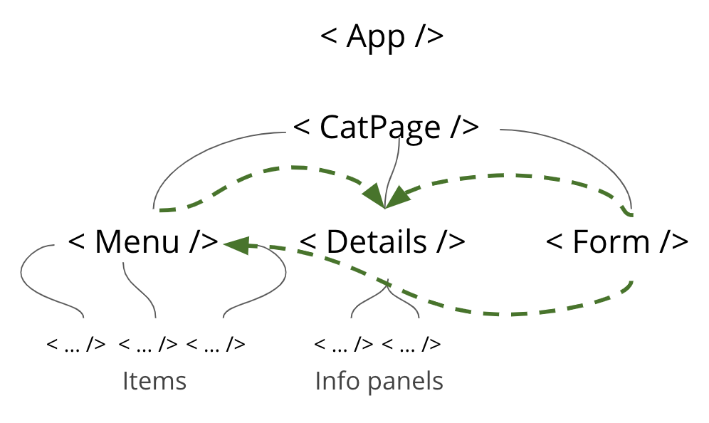
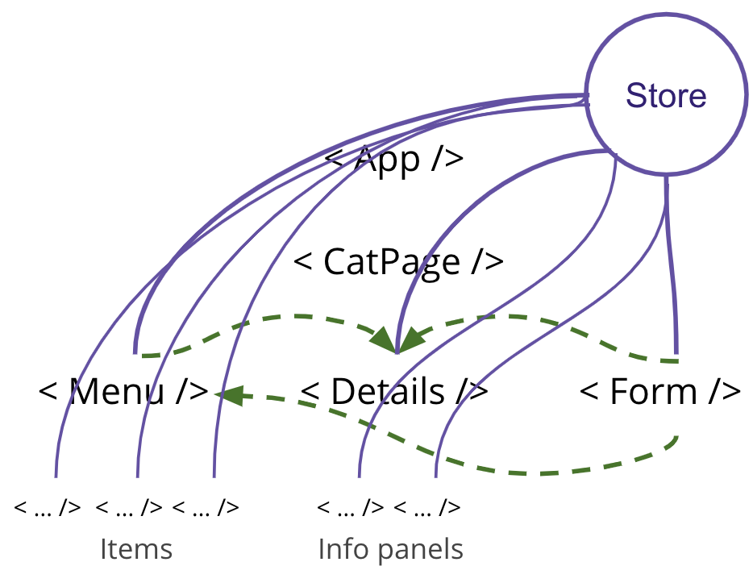
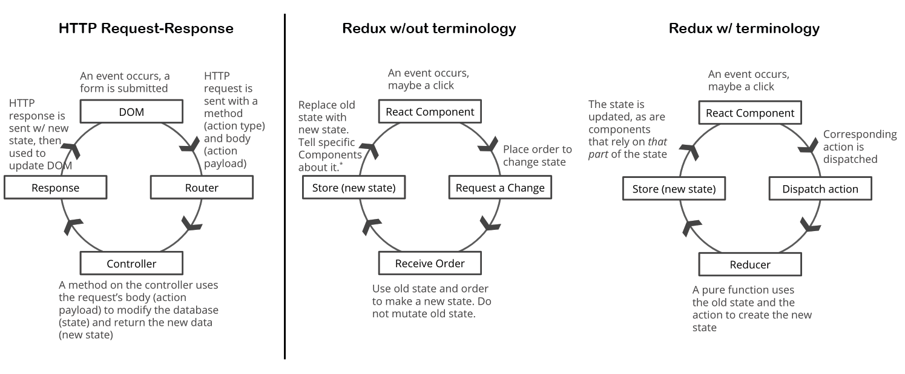

# Intro to Redux
One store to rule them all!!

If you want to do more reading, here's a slideshow I made and didn't use: https://docs.google.com/presentation/d/1S0D2Gdsc75YuEZkXZ_tbg3_aYRZvspNb7DUf6fmqIoc/edit?usp=sharing

Complete code solution, including bonuses and comments: https://github.com/helloRupa/intro-redux/blob/solution/mini-redux.js

## By the end of this lesson, you should be able to:
Explain the Redux data flow using the correct terms. Make a mental jigsaw!!

## But Why?
- Redux can make it easier for us to manage state in our applications
- You might need it in the workplace
- It could help you with your Mod 5 project

## How We'll Get There:
- Explain what Redux is at a high level
- Describe why it's important
    - What's the problem?
    - How does Redux solve it?
    - When should we use Redux?
- Describe how data flows through Redux
    - including appropriate terms: dispatch, action, reducer, store and state
- Build some of Redux together
    - We'll explore the principles of Redux as we do this
    - createStore()
        - getState()
        - dispatch()
    - reducers (so fresh, so pure)
    - actions and action creators
    - combineReducers() if time (this is just being extra ya know)

## What is Redux?
- Tiny library (JS)
- Design pattern (means we follow certain conventions, like how we name things, even though we could do it differently)
- Manage state centrally and predictably (in just one place, not many places!)

## Why is it important?
Because I said so! Nah, just kidding. I kid peeps, I kid.

Our React apps so far have been rather small. They haven't contained a lot of components. You might already know that different slices of state can be stored in different components, and that different components can update the state of other components by passing down props. This is pretty simple stuff in a small app and when working by yourself, but what happens when your app gets really big (tens or hundreds of components) or you start collaborating with others?

**State can be hard to track:** Right now, our apps might have some slice of state stored in Component A and another slice stored in Component B. We can check out what's where using the React Dev Tools, and it's not so hard to debug at this point. If our app has different slices of state stored in say, 10 different components, this gets harder to track and debug once our app stops functioning how we think it should. It gets even harder when you have several different components that are able to update those slices of state. Who made that change to the state we just noticed? Who? Tell me now!

In this image, black lines show how state is passed down via props. Green lines show that components can affect one another by changing that state.


**Difficult to restructure:** When components rely on state being passed down via props, any time we want to restructure our app by removing, adding, or replacing components, we have to remember to pass the props appropriately as well.

**Unnecessary connections:** We have to store different slices of state on components that might not even be using any of that state. Also, we might be passing props through components just so they can get to child components.

**Unnecessary re-rendering:** When the state on a component changes, it re-renders. So what happens when a parent component updates its state? All of its children also re-render even if they don't need to be updated. In a small app, this isn't a big deal. But for a big app, this can slow down your page. Interacting with the DOM is expensive. DOM don't come cheap, DOM likes the monies.

### How does Redux solve these problems?
- Put all of your state in one place, the store! The store is an object that gives access to the state and has some methods you can call on it.
- Give components access to whichever parts of the state they need


- No need to pass props around, many components won't even need their own state (simplify your React code...in a way)
```
// Go from this inside render():
< SpecialSauce sauces={this.state.sauces} changeSauce={this.changeSauce} />

// To this:
< SpecialSauce />
```
- Since components aren't passing state around, you can more easily restructure your app!

- Redux DevTools also provides you with a history of all the changes that have occurred to the state of the app. You can step through it forward and backward, which makes debugging a lot easier!

- Since slices of state can be shared directly with components that need it, you can reduce or eliminate unnecessary re-rendering!

This is all made possible by functional programming! Remember that old friend? Why do you think functional programming helps here?

### When should we use Redux?
> ...don't use Redux until you have problems with vanilla React.” 
> - Dan Abrimov, co-creator of Redux

Ultimately it depends on how complex your app is and how many people you're working with (also, how do those peeps like to work?).

Some questions to ask yourself:
- Is the app too hard to debug because you can't follow how or where the state is being updated?
- Do you have lots of stateful components?
- Can you think of your app as being a combination of smaller apps?
- Is it too hard to work with your team members on this project?
- Is your app slowing down due to unnecessary re-rendering of components?
- Is it hard to test your app when you make changes?

Extra Reading (optional):
https://redux.js.org/faq/general#when-should-i-use-redux
https://medium.com/@dan_abramov/you-might-not-need-redux-be46360cf367

## How does data flow through Redux?
It flows one way, similar to how data flows through the HTTP request-response cycle when making a PATCH request. 

In fact, the flow of data is super-similar to the HTTP request-response cycle. It seems different because of the terminology, but it's really not that different. To be clear, Redux in no way depends upon the HTTP request-response cycle and can exist in an app that does not make any API requests. This is just a comparison to help you figure out where all of the jargony Redux pieces go, so you can build your mental jigsaw.



The Redux Flow:
1. An event (e.g. page load, form submit, click, etc.) triggers the `dispatch` of an `action` to the `store`
    - An `action` is just a POJO with a type and payload. The type is used to route the action, and the payload contains any data required to update the state. `{ type: ADD_CAT, cat: 'Kitty McCatFace' }`
2. The `action` and the current state in the `store` are sent to the `reducer`
    - The `reducer` is a pure function containing a switch statement, which it uses to route the `action`. It returns the new state.
    - `reducer`s are specific to the apps they're in. You define them yourself.
3. If the `action` type matches a case in the `reducer`, a copy of the current state is made, and then updated with data from the `action` payload. If there is no matching case, the old state is returned.
    - The old state is never mutated. This makes the state predictable and easy to test since the `reducer` only relies on its inputs.
4. The state in the `store` is reassigned to the value returned by the `reducer`.
5. Any components that have `subscribe`d or been `connect`ed to the parts of the state that were updated will be updated in the DOM or elsewhere.

## Let's build some Redux together
Better instructions are in Instructions.md
1. createStore() // an Object with some methods on it, gives access to state ({})
2. getState() // available on the store
3. dispatch() // available on the store
4. reducers  // pure functions that set initial state and update it later on
5. actions and action creators  // little POJO requests to update the state
6. combineReducers() (bonus if time allows)  // separate concerns into multiple reducers

> Feed me pies, feed me sweet little pies - Which Fleetwood Mac song did I just dispatch new lyrics to? I just updated its state!!