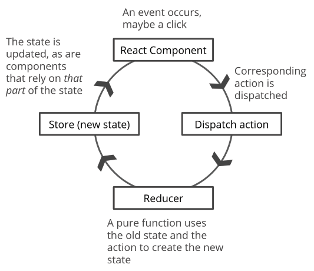

# Add Redux to React
Let's give React a break and have Redux handle our state.

To see all of the solution branches in full:
- [Redux Added](https://github.com/helloRupa/redux-in-react/tree/redux)
- [Peacocks Added](https://github.com/helloRupa/redux-in-react/tree/peacock)

## By the end of this lesson, you should be able to:
Add Redux to a React app for state management! 

> Note: In tomorrow's lesson, we'll use react-redux to do this instead. That is the preferred way. Today, we're just flexing our muscles to prepare for tomorrow.

## But why?
Redux can make it easier to:
- Manage state in large or complex apps
- Work in a team with many people
- Restructure our apps (i.e. add, remove, and move components)

```
// We can go from this:
<MeowBeans addBean={this.addBean} beans={this.state.beans} />

// To this!!:
<MeowBeans />
```

It can also reduce unnecessary component re-rendering in React. Remember, DOM is expensive - it likes the monies. It will make you pay for everything you do. A large app might become slow if there are too many unnecessary re-renders.

DOM is greedy! Bad DOM, bad!

## How we'll get there:
- Code tour
- Install Redux in our app
- Create the store
- Create the reducer to give to the store (stub to begin with)
- Connect to the Redux DevTools
- Add actions to dispatch to the restore, which will be handled by the reducer
- Update our components to work with the store instead of props

## Don't forget the puzzle pieces in our jigsaw!
- createStore()
- getState()
- dispatch()
- reducers
- actions and action creators
- subscribe()



## Install Redux in your app
From the root folder: `npm install --save redux`

In index.js: `import { createStore } from 'redux';`

## Create the store and stub out the reducer
No reducer, no store!

1. Store the initial state of the app in a variable
```
const initialCatState = {
  cats: ['Meowser', 'Charlie', 'Fluffanilla'],
  selectedCat: 'Meowser'
}
```

2. Stub out the `catReducer` so that it returns the initial state

3. Create the store and connect to the Redux DevTools

This will be the second argument to createStore():
`window.__REDUX_DEVTOOLS_EXTENSION__ && window.__REDUX_DEVTOOLS_EXTENSION__()`

4. Also put the store on the window for testing purposes and ease of use (don't deploy to production like this!)

5. Make sure the correct initial state is in the store

## Update Components that read from state
To work with the state stored inside the store

## Add the ability to add a cat via Redux
You will need:
- action/s
- to update the reducer
- to update components
    - actions must be dispatched
    - components must be re-rendered

We can either re-render everything all of the time or only when certain changes happen. We'll see how to do it both ways, and then discuss the benefits of each. In the future (being tomorrow), we'll see how react-redux takes care of this work for us.

## Add the ability to select a cat via Redux
Only existing cats should be selectable. Also, when a new cat is added via the form, that new cat should be selected.

You will need:
- action/s
- to update the reducer
- to update components
    - actions must be dispatched
    - components must be re-rendered

Need to deal with re-renders again.

## Restructure your code
Right now, everything is in one file. Let's reorganize!

There are different ways to approach organizing React code that has Redux in it. For example, there is the ducks pattern, or organizing by function, or by feature. Here's a reading if you want: https://www.freecodecamp.org/news/scaling-your-redux-app-with-ducks-6115955638be/

We'll be organizing by function:
- all action files in one folder
- all reducer files in one folder

Don't forget to export!

## BONUS: add another reducer for a new slice of state (combineReducers())
Let's try adding peacocks to our app!

## Redux Checklist:
1. Install Redux in your app
2. Create the store
    - You'll need to provide it with a reducer
    - Optionally, you can also connect to the Redux DevTools here
3. Check that the store returns the correct initial state by:
    - Using the Redux DevTools OR
    - Putting the store on the window and calling getState() on the store
4. Update any Components relying on reading state to use the state in the store
5. Subscribe those components to the store and provide a callback that forces the Component to update
6. Create actions that serve as requests to modify the state in the store
7. Update reducers to respond to actions
8. Update any Components that modify state to dispatch those actions
